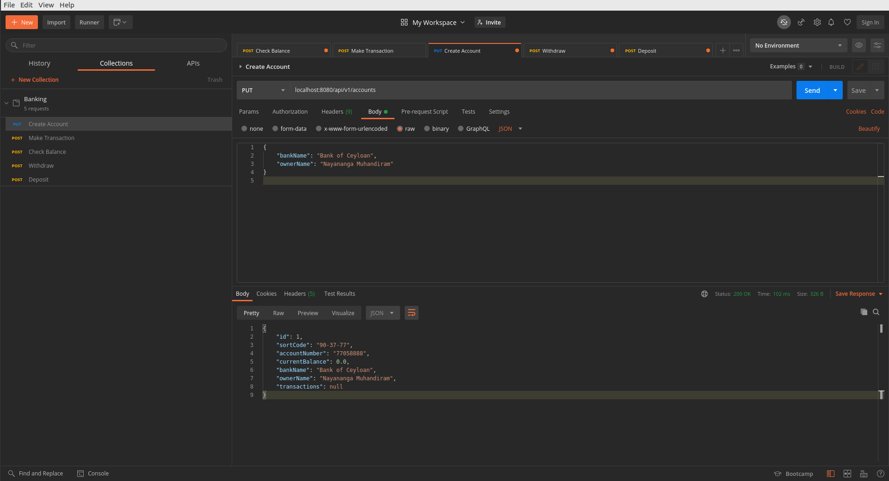
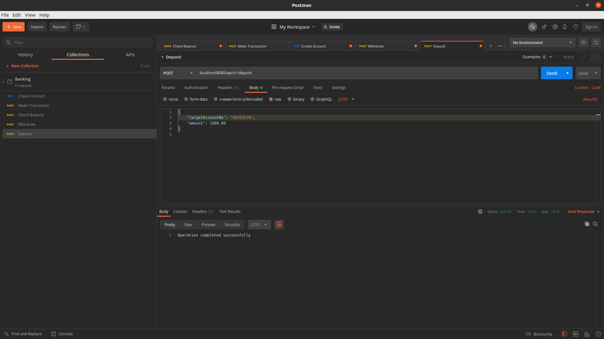
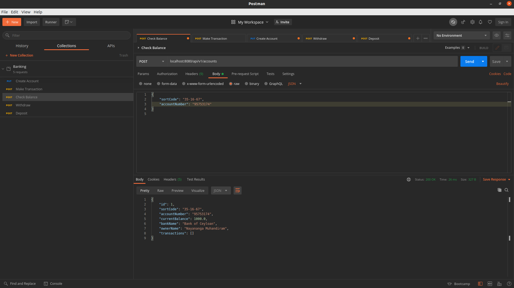
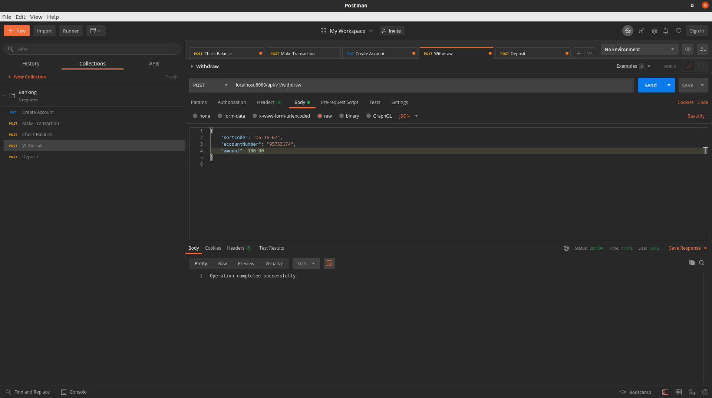
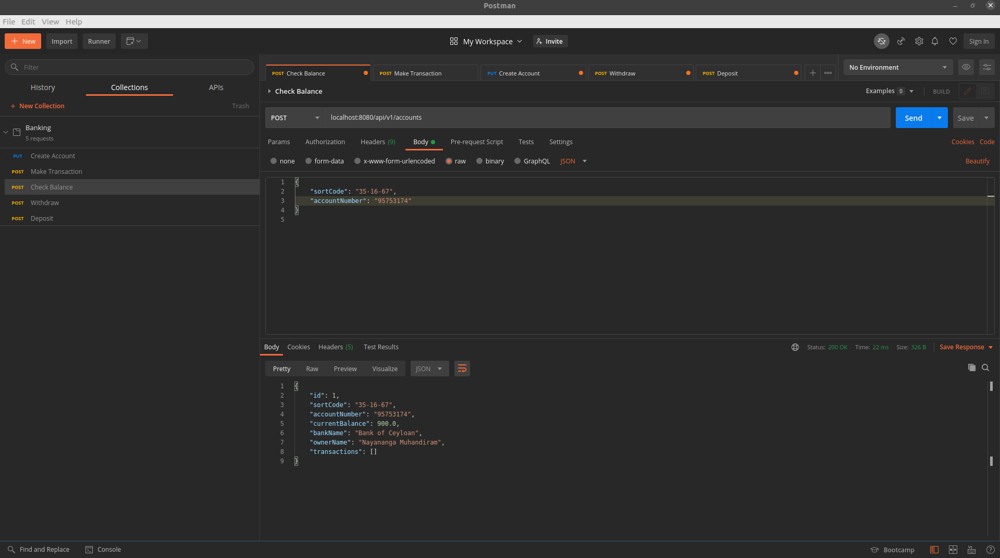

# Spring-boot Banking
Example project demonstrating the use of Java and Spring-boot to build a microservice to be used by an online bank

## Running locally
```
./mvnw clean install -DskipTests=true
```

```
java -jar target/Banking-0.0.1.jar
```

## Running on Docker
```
docker build -t "spring-boot:banking" .
```

```
docker run -p 8080:8080 spring-boot:banking
```

## Testing
Import the Postman collection file into the application or copy the request body from there

### How to test
1. Create account
   > Use create account API to create an account by providing a `bankName` and `ownerName`
   > 
   

> Make sure to write down the `sortCode` and the `accountNumber` to proceed with other APIs

2. Deposit Cash
   >Use noted `accountNumber` as `targetAccountNo` and provide amount greater than zero to deposit cash into an account
   
   

3. Check Balance
   >Use noted `accountNumber` and `sortCode` to check account balance

   
   
4. Withdraw Cash
   >Use noted `accountNumber` and `sortCode` and `amount` grater than zero to withdraw cash from an account

   
    
5. Check Balance again to verify withdrawal

   
   


### Extensions
1. Use of persisted database
2. Use of asynchronous programming backed by message queue for transactions
3. Others mentioned throughout the code